# 執行管道

了解 Spine 的請求生命週期。

## 大綱

Spine 的核心理念是**執行流程的明確性**。雖然大多數 Web 框架在內部隱藏請求處理，但 Spine 將所有步驟錨定到程式碼結構中並清楚地公開它們。

所有 HTTP 請求**必須**依序通過以下管道：

```mermaid
graph TD
    Request["HTTP Request"]

    ExecutionContext["ExecutionContext<br>(创建请求上下文)"]
    GlobalPre["Global Interceptor.PreHandle<br>(路由前预处理)"]
    Router["Router<br>(选择 HandlerMeta)"]
    ParamMeta["ParameterMeta Builder<br>(构建参数元数据)"]
    ArgResolver["ArgumentResolver Chain<br>(生成参数值)"]
    RoutePre["Route Interceptor.PreHandle<br>(路由预处理)"]
    Invoker["Invoker<br>(调用 Controller 方法)"]
    ReturnHandler["ReturnValueHandler<br>(将返回值转换为响应)"]
    PostHook["PostExecutionHook<br>(发布事件等)"]
    RoutePost["Route Interceptor.PostHandle ↩<br>(路由后处理)"]
    GlobalPost["Global Interceptor.PostHandle ↩<br>(全局后处理)"]
    RouteAfter["Route Interceptor.AfterCompletion ↩<br>(始终执行)"]
    GlobalAfter["Global Interceptor.AfterCompletion ↩<br>(始终执行)"]
    ErrorHandler["handleExecutionError<br>(错误安全网)"]
    Response["HTTP Response"]

    Request --> ExecutionContext
    ExecutionContext --> GlobalPre
    GlobalPre --> Router
    Router --> ParamMeta
    ParamMeta --> ArgResolver
    ArgResolver --> RoutePre
    RoutePre --> Invoker
    Invoker --> ReturnHandler
    ReturnHandler --> PostHook
    PostHook --> RoutePost
    RoutePost --> GlobalPost
    GlobalPost --> RouteAfter
    RouteAfter --> GlobalAfter
    GlobalAfter --> ErrorHandler
    ErrorHandler --> Response
```




## 1. 建立 ExecutionContext

當 HTTP 請求到達時，傳輸適配器 (Echo) 會將請求轉換為 Spine 的 `ExecutionContext`。

```go
// 內部/適配器/echo/adapter.go
func (s *Server) handle(c echo.Context) error {
    ctx := NewContext(c)

    ctx.Set(
        "spine.response_writer",
        NewEchoResponseWriter(c),
    )

    if err := s.pipeline.Execute(ctx); err != nil {
        c.Logger().Errorf("pipeline error: %v", err)
        // 因為響應已經寫入管道內
        // 不要向 Echo 預設錯誤處理程序發送重複的訊息。
        return nil
    }
    return nil
}
```

`ExecutionContext` 是跨管道共享的請求範圍上下文。您可以存取請求中的所有信息，包括 HTTP 方法、路徑、標頭和查詢參數。

> **注意**：WebSocket 請求也使用相同的 Pipeline。 `ws.Runtime` 為每個訊息產生 `WSExecutionContext` 並呼叫 `pipeline.Execute(ctx)`。

## 2.全域攔截器.PreHandle

**在路由之前**先運行全域攔截器。此時尚未確定將執行哪個處理程序，因此傳遞了一個空的 `HandlerMeta` 。

```go
// 內部/管道/pipeline.go
globalMeta := core.HandlerMeta{}

for _, it := range p.interceptors {
    if err := it.PreHandle(ctx, globalMeta); err != nil {
        if errors.Is(err, core.ErrAbortPipeline) {
            return nil
        }
        return err
    }
}
```

當需要在路由之前攔截請求時使用此選項，例如 CORS 預檢處理：

```go
// 攔截器/cors/cors.go
if ctx.Method() == "OPTIONS" {
    rw.WriteStatus(204)
    return core.ErrAbortPipeline
}
```

## 3.選擇路由器-HandlerMeta

Router根據請求路徑和方法來決定執行哪個Controller方法。

```go
// 內部/路由器/router.go
func (r *DefaultRouter) Route(ctx core.ExecutionContext) (core.HandlerMeta, error) {
    for _, route := range r.routes {
        if route.Method != ctx.Method() {
            continue
        }

        ok, params, keys := matchPath(route.Path, ctx.Path())
        if !ok {
            continue
        }

        // 路徑參數注入
        ctx.Set("spine.params", params)
        ctx.Set("spine.pathKeys", keys)

        return route.Meta, nil
    }
    return core.HandlerMeta{}, httperr.NotFound("找不到处理器.")
}
```

`HandlerMeta` 包含執行檔的元資料：

```go
// 核心/handler_meta.go
type HandlerMeta struct {
    ControllerType reflect.Type    // 控制器类型
    Method         reflect.Method  // 要调用的方法
    Interceptors   []Interceptor   // 路由级拦截器
}
```

## 4.ParameterMeta配置

分析Controller方法的簽章並產生每個參數的元資訊。

```go
// 內部/管道/pipeline.go
func buildParameterMeta(method reflect.Method, ctx core.ExecutionContext) []resolver.ParameterMeta {
    pathKeys := ctx.PathKeys()
    pathIdx := 0
    var metas []resolver.ParameterMeta

    for i := 1; i < method.Type.NumIn(); i++ {
        pt := method.Type.In(i)

        pm := resolver.ParameterMeta{
            Index: i - 1,
            Type:  pt,
        }

        // 如果是path.*類型，則依序分配PathKey。
        if isPathType(pt) {
            if pathIdx >= len(pathKeys) {
                pm.PathKey = ""
            } else {
                pm.PathKey = pathKeys[pathIdx]
            }
            pathIdx++
        }

        metas = append(metas, pm)
    }

    return metas
}

func isPathType(pt reflect.Type) bool {
    pathPkg := reflect.TypeFor[path.Int]().PkgPath()
    return pt.PkgPath() == pathPkg
}
```

**路徑參數綁定規則**：Spine 使用基於順序的綁定。 PathKey 只指派給屬於 `path` 套件的類型（`path.Int`、`path.String`、`path.Boolean`）。

```go
// 路線：/users/:userId/posts/:postId
// 控制器：
func GetPost(userId path.Int, postId path.Int) // ✓ 顺序一致
```

## 5.ArgumentResolver 鏈

適用於每種參數類型的解析器會產生實際值。

```go
// 內部/管道/pipeline.go
func (p *Pipeline) resolveArguments(ctx core.ExecutionContext, paramMetas []resolver.ParameterMeta) ([]any, error) {
    args := make([]any, 0, len(paramMetas))

    for _, paramMeta := range paramMetas {
        resolved := false

        for _, r := range p.argumentResolvers {
            if !r.Supports(paramMeta) {
                continue
            }

            val, err := r.Resolve(ctx, paramMeta)
            if err != nil {
                return nil, err
            }

            args = append(args, val)
            resolved = true
            break
        }

        if !resolved {
            return nil, fmt.Errorf(
                "ArgumentResolver 缺少参数. %d (%s)",
                paramMeta.Index,
                paramMeta.Type.String(),
            )
        }
    }
    return args, nil
}
```

### 內建旋轉變壓器

|旋轉變壓器|支援類型|描述 |
|----------|----------|------|
| `StdContextResolver` | `StdContextResolver` `context.Context` | `context.Context`標準上下文（EventBus 注入）|
| `ControllerContextResolver` | `ControllerContextResolver` `core.ControllerContext` | `core.ControllerContext` ExecutionContext 只讀
| `HeaderResolver` | `HeaderResolver` `header.*` | `header.*` HTTP 標頭值 |
| `PathIntResolver` | `PathIntResolver` `path.Int` | `path.Int`從路徑中提取整數 |
| `PathStringResolver` | `PathStringResolver` `path.String` | `path.String`從路徑中提取字串 |
| `PathBooleanResolver` | `PathBooleanResolver` `path.Boolean` | `path.Boolean`從路徑中提取布林值 |
| `PaginationResolver` | `PaginationResolver` `query.Pagination` | `query.Pagination`頁、尺寸查詢參數|
| `QueryValuesResolver` | `QueryValuesResolver` `query.Values` | `query.Values`完整查詢參數檢視 |
| `DTOResolver` | `DTOResolver` `*struct`（指標）| JSON 正文綁定 |
| `FormDTOResolver` | `FormDTOResolver` `*struct`（表單標籤）|多部分/表單綁定 |
| `UploadedFilesResolver` | `UploadedFilesResolver` `multipart.Form` | `multipart.Form`上傳檔案 |

### ArgumentResolver 介面

```go
// 內部/解析器/argument.go
type ArgumentResolver interface {
    // 判斷這個Resolver是否可以處理該類型
    Supports(parameterMeta ParameterMeta) bool

    // 從上下文產生實際值
    Resolve(ctx core.ExecutionContext, parameterMeta ParameterMeta) (any, error)
}
```

> **注意**：解析器採用 `core.ExecutionContext` 並可選擇鍵入斷言 `core.HttpRequestContext`、`core.ConsumerRequestContext` 和 `core.WebSocketContext`。

## 6. 路由攔截器.PreHandle

路由之後，路由等級攔截器在Controller呼叫之前執行。此攔截器包含在 `HandlerMeta.Interceptors` 中，並且僅適用於該特定處理程序。

```go
routeInterceptors := meta.Interceptors

for _, it := range routeInterceptors {
    if err := it.PreHandle(ctx, meta); err != nil {
        if errors.Is(err, core.ErrAbortPipeline) {
            return nil
        }
        return err
    }
}
```

### 攔截器接口

```go
// 核心/攔截器.go
type Interceptor interface {
    // 在呼叫Controller之前執行
    PreHandle(ctx ExecutionContext, meta HandlerMeta) error

    // 處理ReturnValueHandler後執行
    PostHandle(ctx ExecutionContext, meta HandlerMeta)

    // 無論成功/失敗最後調用
    AfterCompletion(ctx ExecutionContext, meta HandlerMeta, err error)
}
```

### 全域攔截器與路由攔截器

|類別 |如何報名 |何時跑步 |元內容 |
|------|----------|----------|----------|
|全球| `app.Interceptor()` | `app.Interceptor()`路由 **之前** |空白 `HandlerMeta{}` |
|路線 | `route.WithInterceptors()` | `route.WithInterceptors()`路由**之後**，控制器**之前** |實際 `HandlerMeta` |

### 管道中止

如果 `PreHandle` 傳回 `core.ErrAbortPipeline`，則跳過後續步驟。但是，`AfterCompletion` 總是會被執行。

## 7. Invoker - 控制器方法調用

從 IoC 容器取得一個 Controller 實例並呼叫該方法。

```go
// 內部/呼叫者/invoker.go
func (i *Invoker) Invoke(controllerType reflect.Type, method reflect.Method, args []any) ([]any, error) {
    // 解析容器中的實例
    controller, err := i.container.Resolve(controllerType)
    if err != nil {
        return nil, err
    }

    // 使用反射呼叫方法
    values := make([]reflect.Value, len(args)+1)
    values[0] = reflect.ValueOf(controller)
    for idx, arg := range args {
        values[idx+1] = reflect.ValueOf(arg)
    }

    results := method.Func.Call(values)

    // 結果轉化
    out := make([]any, len(results))
    for i, result := range results {
        out[i] = result.Interface()
    }

    return out, nil
}
```

**控制器的職責**：控制器純粹負責業務邏輯。我對 HTTP、管道或執行順序一無所知。

```go
func (c *UserController) GetUser(userId path.Int) (User, error) {
    if userId.Value <= 0 {
        return User{}, httperr.BadRequest("用户 ID 无效")
    }
    return c.repo.FindByID(userId.Value)
}
```

## 8. 傳回值處理程序

將控制器的回傳值轉換為 HTTP 回應。首先處理錯誤類型，並使用 `isNilResult()` 執行全面的 nil 檢查。

```go
// 內部/管道/pipeline.go
func (p *Pipeline) handleReturn(ctx core.ExecutionContext, results []any) error {
    // 如果出現錯誤，則僅處理錯誤並退出。
    for _, result := range results {
        if isNilResult(result) {
            continue
        }
        if _, isErr := result.(error); isErr {
            resultType := reflect.TypeOf(result)
            for _, h := range p.returnHandlers {
                if h.Supports(resultType) {
                    if err := h.Handle(result, ctx); err != nil {
                        return err
                    }
                    return nil
                }
            }
            return fmt.Errorf(
                "没有 ReturnValueHandler 处理 error 返回值. (%s)",
                resultType.String(),
            )
        }
    }

    // 如果沒有錯誤，則處理第一個非nil值
    for _, result := range results {
        if isNilResult(result) {
            continue
        }
        resultType := reflect.TypeOf(result)
        handled := false
        for _, h := range p.returnHandlers {
            if !h.Supports(resultType) {
                continue
            }
            if err := h.Handle(result, ctx); err != nil {
                return err
            }
            handled = true
            break
        }
        if !handled {
            return fmt.Errorf(
                "找不到 ReturnValueHandler. (%s)",
                resultType.String(),
            )
        }
    }
    return nil
}
```

### 內建處理程序

|處理程序 |支援類型|回應格式 |
|---------|----------|----------|
| `RedirectReturnValueHandler` | `RedirectReturnValueHandler` `httpx.Redirect` | `httpx.Redirect`位置標頭 + 302 |
| `BinaryReturnHandler` | `BinaryReturnHandler` `httpx.Binary` | `httpx.Binary`二進位資料（檔案等）|
| `StringReturnHandler` | `StringReturnHandler` `httpx.Response[string]` | `httpx.Response[string]`純文字|
| `JSONReturnHandler` | `JSONReturnHandler` `httpx.Response[T]`（T ≠ 字串）| JSON |
| `ErrorReturnHandler` | `ErrorReturnHandler` `error` | `error` JSON（狀態代碼映射）|

### ReturnValueHandler 接口

```go
// 內部/處理程序/return_value.go
type ReturnValueHandler interface {
    Supports(returnType reflect.Type) bool
    Handle(value any, ctx core.ExecutionContext) error
}
```

## 9.PostExecutionHook

ReturnValueHandler 處理後，將執行已註冊的後處理掛鉤。通常，領域事件發布是在這個階段進行的。

```go
// 運行 PostHooks
for _, hook := range p.postHooks {
    hook.AfterExecution(ctx, results, returnError)
}
```

```go
// 內部/事件/鉤子/post_execution.go
func (h *EventDispatchHook) AfterExecution(ctx core.ExecutionContext, results []any, err error) {
    if err != nil {
        return
    }
    events := ctx.EventBus().Drain()
    if len(events) == 0 {
        return
    }
    h.Dispatcher.Dispatch(ctx.Context(), events)
}
```

## 10.Interceptor.PostHandle & AfterCompletion

### 後句柄

ReturnValueHandler處理完後，依照相反的順序執行。路由攔截器先運行，全域攔截器最後運行。

```go
// 路由攔截器 postHandle（反向）
for i := len(routeInterceptors) - 1; i >= 0; i-- {
    routeInterceptors[i].PostHandle(ctx, meta)
}

// 全域攔截器postHandle（逆序）
for i := len(p.interceptors) - 1; i >= 0; i-- {
    p.interceptors[i].PostHandle(ctx, meta)
}
```

### 完成後

無論成功/失敗，**始終**運行。保證為 `defer`。先清理路由攔截器，最後清理全域攔截器。

```go
// 完成後的路由攔截器（延遲 - 始終運行）
defer func() {
    for i := len(routeInterceptors) - 1; i >= 0; i-- {
        routeInterceptors[i].AfterCompletion(ctx, meta, finalErr)
    }
}()

// 全域攔截器 AfterCompletion（延遲 - 始終運行）
defer func() {
    for i := len(p.interceptors) - 1; i >= 0; i-- {
        p.interceptors[i].AfterCompletion(ctx, globalMeta, finalErr)
    }
}()
```

它用於資源清理、日誌記錄、指標收集等。

## 11.handleExecutionError - 錯誤安全網

如果在管道執行期間發生錯誤，則會寫入回應作為最終安全網。當回應已經提交時，防止重複回應。

```go
// 內部/管道/pipeline.go
defer func() {
    if finalErr != nil {
        p.handleExecutionError(ctx, finalErr)
    }
}()

func (p *Pipeline) handleExecutionError(ctx core.ExecutionContext, err error) {
    rwAny, ok := ctx.Get("spine.response_writer")
    if !ok {
        return
    }
    rw, ok := rwAny.(core.ResponseWriter)
    if !ok {
        return
    }

    // 响应已提交时防止重复响应
    if rw.IsCommitted() {
        return
    }

    var httpErr *httperr.HTTPError
    if errors.As(err, &httpErr) {
        rw.WriteJSON(httpErr.Status, map[string]any{
            "message": httpErr.Message,
        })
        return
    }

    rw.WriteJSON(500, map[string]any{
        "message": "Internal server error",
    })
}
```

## 攔截器執行順序詳細信息

這是透過測試程式碼驗證的實際執行順序：

### 正常流量

```
pre:global → pre:route → [Controller] → post:route → post:global → after:route → after:global
```

### 在路由攔截器中中止 (ErrAbortPipeline)

```
pre:global → pre:route → after:route → after:global
```

控制器永遠不會被調用，但 `AfterCompletion` 總是被執行。

### 在全域攔截器中中止 (ErrAbortPipeline)

```
pre:global → after:global
```

路由器也沒有被調用，因此路由攔截器也沒有被執行。

## 完整執行流程程式碼

```go
// 內部/管道/pipeline.go
func (p *Pipeline) Execute(ctx core.ExecutionContext) (finalErr error) {
    // 錯誤安全網：發生錯誤時寫入回應
    defer func() {
        if finalErr != nil {
            p.handleExecutionError(ctx, finalErr)
        }
    }()

    // 全域攔截器 AfterCompletion（始終運行）
    globalMeta := core.HandlerMeta{}
    defer func() {
        for i := len(p.interceptors) - 1; i >= 0; i-- {
            p.interceptors[i].AfterCompletion(ctx, globalMeta, finalErr)
        }
    }()

    // 1.全域攔截器PreHandle（路由前）
    for _, it := range p.interceptors {
        if err := it.PreHandle(ctx, globalMeta); err != nil {
            if errors.Is(err, core.ErrAbortPipeline) {
                return nil
            }
            return err
        }
    }

    // 2. 路由器決定要執行什麼
    meta, err := p.router.Route(ctx)
    if err != nil {
        return err
    }

    routeInterceptors := meta.Interceptors

    // 完成後的路由攔截器（始終運行）
    defer func() {
        for i := len(routeInterceptors) - 1; i >= 0; i-- {
            routeInterceptors[i].AfterCompletion(ctx, meta, finalErr)
        }
    }()

    // 3. 建立參數元
    paramMetas := buildParameterMeta(meta.Method, ctx)

    // 4.ArgumentResolver鏈執行
    args, err := p.resolveArguments(ctx, paramMetas)
    if err != nil {
        return err
    }

    // 5. 路由攔截器PreHandle
    for _, it := range routeInterceptors {
        if err := it.PreHandle(ctx, meta); err != nil {
            if errors.Is(err, core.ErrAbortPipeline) {
                return nil
            }
            return err
        }
    }

    // 6.呼叫Controller方法
    results, err := p.invoker.Invoke(meta.ControllerType, meta.Method, args)
    if err != nil {
        return err
    }

    // 7.ReturnValueHandler處理
    returnError := p.handleReturn(ctx, results)

    // 8.PostExecutionHook（活動發布等）
    for _, hook := range p.postHooks {
        hook.AfterExecution(ctx, results, returnError)
    }

    if returnError != nil {
        return returnError
    }

    // 9. 路由攔截器PostHandle（逆序）
    for i := len(routeInterceptors) - 1; i >= 0; i-- {
        routeInterceptors[i].PostHandle(ctx, meta)
    }

    // 10.全域攔截器PostHandle（逆序）
    for i := len(p.interceptors) - 1; i >= 0; i-- {
        p.interceptors[i].PostHandle(ctx, meta)
    }

    return nil
}
```

## 管道結構

```go
// 內部/管道/pipeline.go
type Pipeline struct {
    router            router.Router
    interceptors      []core.Interceptor
    argumentResolvers []resolver.ArgumentResolver
    returnHandlers    []handler.ReturnValueHandler
    invoker           *invoker.Invoker
    postHooks         []hook.PostExecutionHook
}
```

Pipeline 同樣用於 Single HTTP Pipeline、Consumer Pipeline 和 WebSocket Pipeline。每個Transport都會建立一個單獨的Pipeline實例，只有Resolver和Handler配置不同。

## 概括

|步驟|組件|責任|
|------|----------|------|
| 1 |傳輸適配器| HTTP → ExecutionContext 轉換 |
| 2 |全域攔截器.PreHandle |路由前的預處理（CORS等）|
| 3 |路由器|請求路徑→HandlerMeta 映射|
| 4 |參數元產生器 |方法簽章分析 |
| 5 |參數解析器 |參數類型 → 建立實際值 |
| 6 |路由攔截器.PreHandle |路由預處理（認證等） |
| 7 |祈求者 |控制器方法呼叫 |
| 8 |傳回值處理程序 |傳回值→HTTP回應轉換|
| 9 |執行後鉤子 |發布領域事件等後處理 |
| 10 | 10路由攔截器.PostHandle ↩ |路線後處理（逆序）|
| 11 | 11全域攔截器.PostHandle ↩ |全域後處理（逆序）|
| 12 | 12完成後 ↩ |清理（路由 → 全局，始終運行）|
| 13 |處理執行錯誤 |錯誤安全網（防止雙重回應）|

這個順序**不隱藏，也不隱式改變。 **這是Spine的「No Magic」哲學。
