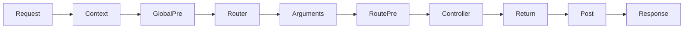

# 執行管線

## 概覽

Spine 的每個請求都經過同一條明確的執行管線。管線建立上下文、選擇處理器、解析參數、執行攔截器、呼叫控制器，並將回傳值寫入回應。

## 執行步驟

1. 建立與傳輸協定對應的 `ExecutionContext`。
2. 執行全域攔截器的 `PreHandle`。
3. Router 選擇符合路由的 `HandlerMeta`。
4. 依處理器簽章建立參數中繼資料，並由 `ArgumentResolver` 鏈解析參數。
5. 執行路由攔截器的 `PreHandle`。
6. Invoker 呼叫控制器方法。
7. `ReturnValueHandler` 將回傳值或錯誤轉換為回應。
8. 執行後置鉤子，以及 `PostHandle` 和 `AfterCompletion`。

## 攔截器範圍

全域攔截器適用所有請求；路由攔截器只適用註冊它的路由。前置處理依註冊順序執行，後置與完成處理則反向執行。

## 參數、回傳值與錯誤

內建解析器可處理 `context.Context`、`query.Values`、路徑參數、DTO、上傳檔案與 `spine.Ctx`。回傳值處理器則處理 `httpx.Response[T]`、重新導向與 `error`。

攔截器可回傳錯誤來中止管線；不論結果如何，`AfterCompletion` 都會執行，適合清理資源或回滾交易。

## 總結

單一管線支援多種傳輸協定，並使執行順序、擴充點和錯誤處理都保持可見。
