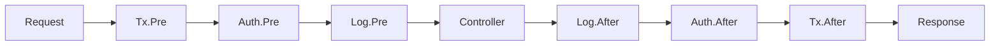

＃ 介紹

## 什麼是脊椎？

Spine 是**不隱藏請求流程的 Go Web 框架**。

明確執行管道揭示如何解釋請求、執行順序、何時調用業務邏輯以及如何在回應中完成請求。

```go
func main() {
    app := spine.New()
    
    // 註冊相依性 — 順序不限，只要註冊建構函式即可自動解析
    app.Constructor(NewUserRepository, NewUserService, NewUserController)
    
    // 攔截器－執行順序在程式碼中可見
    app.Interceptor(&TxInterceptor{}, &LoggingInterceptor{})
    
    // 路線 — 哪個方法是哪一條路線一目了然。
    app.Route("GET", "/users", (*UserController).GetUser)
    
    if err := app.Run(boot.Options{
		Address:                ":8080",
		EnableGracefulShutdown: true,
		ShutdownTimeout:        10 * time.Second,
		HTTP: &boot.HTTPOptions{},
	}); err != nil {
		log.Fatal(err)
	}
}
```

## 為什麼是脊椎？

### 沒有隱藏的魔法

Spring Boot 中為 `@Autowired`，NestJS 中為 `@Injectable`。
方便，但很難看到裡面發生了什麼。

脊柱不一樣。

- **無註解** — 純 Go 程式碼
- **沒有模組定義** - DI 只需透過註冊建構函式即可解決
- **無代理** — 堆疊追蹤非常直觀

阅读代码即可看到执行流程。

### 熟悉的結構

如果您使用過Spring或NestJS，您可以立即開始。

```
Controller → Service → Repository
```

建構函式注入、攔截器鏈和分層架構。
将熟悉的模式带入 Go。

### Go 中的效能

- 無需 JVM 預熱
- 沒有 Node.js 運行時初始化
- 編譯後的二進位檔案立即執行

針對容器和無伺服器環境進行了最佳化。

## 關鍵概念

### 1. 基於建構子的依賴注入

```go
// 建構函數參數是依賴關係的聲明
func NewUserService(repo *UserRepository) *UserService {
    return &UserService{repo: repo}
}

// 簡單註冊並自動解決依賴圖
app.Constructor(NewUserRepository, NewUserService, NewUserController)
```

### 2.攔截器管道

```go
app.Interceptor(
    &TxInterceptor{},      // 1. 开始事务
    &AuthInterceptor{},    // 2. 检查认证
    &LoggingInterceptor{}, // 3. 日志记录
)

```

**執行順序：**



### 3.明確路由

```go
// 在一處管理您的所有路線
func RegisterUserRoutes(app spine.App) {
    app.Route("GET", "/users", (*UserController).GetUser)
    app.Route("POST", "/users", (*UserController).CreateUser)
    app.Route("PUT", "/users", (*UserController).UpdateUser)
    app.Route("DELETE", "/users", (*UserController).DeleteUser)
}
```

### 4. 類型安全處理程序

```go
// 函數簽名是API規範
func (c *UserController) GetUser(
    ctx context.Context,      // 上下文
    q query.Values,           // 查询参数
) (httpx.Response[UserResponse], error) {     // 回應型別
    user, err := c.svc.Get(ctx, q.Int("id", 0))
    if err != nil {
        return httpx.Response[UserResponse]{}, err
    }
    return httpx.Response[UserResponse]{Body: user}, nil
}

// DTO 自動綁定
func (c *UserController) CreateUser(
    ctx context.Context,
    req *CreateUserRequest,    // JSON body → 结构体（指针）
) (httpx.Response[UserResponse], error) {
    user, err := c.svc.Create(ctx, req)
    if err != nil {
        return httpx.Response[UserResponse]{}, err
    }
    return httpx.Response[UserResponse]{Body: user}, nil
}
```

## 與其他框架的比較

| |脊柱 | NestJS |春季啟動 |
|---|:---:|:---:|:---:|
| **語言** |去 |打字稿 | Java/Kotlin |
| **執行時期** |本機二進位 | Node.js | JVM |
| **IoC 容器** | ✅ | ✅ | ✅ |
| **註解/裝飾器** |沒有必要|必填|必填|
| **模組定義** |沒有必要|必填|沒有必要|
| **類型安全性** |編譯時間|執行時期|編譯時間|

## 你準備好開始了嗎？

```bash
go get github.com/NARUBROWN/spine
```

[5 分鐘快速入門 →](/zh-Hant/learn/getting-started/first-app)
