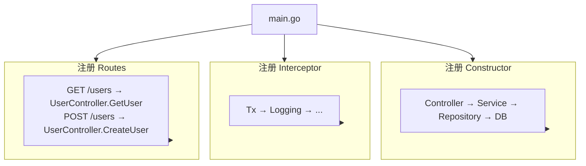

# 專案結構

如何建構 Spine 專案。

## 推薦結構

```
my-app/
├── main.go                  # 应用入口
├── go.mod
├── go.sum
│
├── controller/              # 控制器層
│   └── user_controller.go
│
├── service/                 # 服务层（业务逻辑）
│   └── user_service.go
│
├── repository/              # 儲存庫層（資料存取）
│   └── user_repository.go
│
├── entity/                  # 数据库实体
│   └── user.go
│
├── dto/                     # 请求/响应对象
│   ├── user_request.go
│   └── user_response.go
│
├── routes/                  # 路由定義
│   └── user_routes.go
│
├── interceptor/             # 拦截器
│   ├── tx_interceptor.go
│   └── logging_interceptor.go
│
└── migrations/              # 数据库迁移
    ├── 001_create_users.up.sql
    └── 001_create_users.down.sql
```

## 各層的作用

### main.go

這是應用程式的入口點。註冊構造函數，設定攔截器，並註冊路由。

```go
package main

import (
    "log"
    "time"

    "github.com/NARUBROWN/spine"
    "github.com/NARUBROWN/spine/pkg/boot"
)

func main() {
    app := spine.New()

    // 1. 註冊一個建構函數
    app.Constructor(
        NewDB,
        repository.NewUserRepository,
        service.NewUserService,
        controller.NewUserController,
        interceptor.NewTxInterceptor,
    )

    // 2.註冊攔截器
    app.Interceptor(
        (*interceptor.TxInterceptor)(nil),
        &interceptor.LoggingInterceptor{},
    )

    // 3. 路線註冊
    routes.RegisterUserRoutes(app)

    // 4.啟動伺服器
    if err := app.Run(boot.Options{
		Address:                ":8080",
		EnableGracefulShutdown: true,
		ShutdownTimeout:        10 * time.Second,
		HTTP: &boot.HTTPOptions{},
	}); err != nil {
		log.Fatal(err)
	}
}
```

＃＃＃控制器/

接收 HTTP 請求並將其委託給服務。不包含任何業務邏輯。

```go
// 控制器/user_controller.go
package controller

import (
    "context"

    "dto"
    "service"

    "github.com/NARUBROWN/spine/pkg/httpx"
    "github.com/NARUBROWN/spine/pkg/query"
)

type UserController struct {
    svc *service.UserService  // 服務相依性
}

func NewUserController(svc *service.UserService) *UserController {
    return &UserController{svc: svc}
}

// 函數簽名是API規範
func (c *UserController) GetUser(
    ctx context.Context,
    q query.Values,
) (httpx.Response[dto.UserResponse], error) {
    id := int(q.Int("id", 0))
    user, err := c.svc.Get(ctx, id)
    if err != nil {
        return httpx.Response[dto.UserResponse]{}, err
    }
    return httpx.Response[dto.UserResponse]{Body: user}, nil
}

func (c *UserController) CreateUser(
    ctx context.Context,
    req *dto.CreateUserRequest,
) (httpx.Response[dto.UserResponse], error) {
    user, err := c.svc.Create(ctx, req.Name, req.Email)
    if err != nil {
        return httpx.Response[dto.UserResponse]{}, err
    }
    return httpx.Response[dto.UserResponse]{Body: user}, nil
}
```

＃＃＃服務/

負責業務邏輯。透過儲存庫存取資料。

```go
// 服務/user_service.go
package service

type UserService struct {
    repo *repository.UserRepository  // 儲存庫相依性
}

func NewUserService(repo *repository.UserRepository) *UserService {
    return &UserService{repo: repo}
}

func (s *UserService) Get(ctx context.Context, id int) (dto.UserResponse, error) {
    user, err := s.repo.FindByID(ctx, id)
    if err != nil {
        return dto.UserResponse{}, err
    }
    
    return dto.UserResponse{
        ID:    int(user.ID),
        Name:  user.Name,
        Email: user.Email,
    }, nil
}

func (s *UserService) Create(ctx context.Context, name, email string) (dto.UserResponse, error) {
    user := &entity.User{Name: name, Email: email}
    
    if err := s.repo.Save(ctx, user); err != nil {
        return dto.UserResponse{}, err
    }
    
    return dto.UserResponse{
        ID:    int(user.ID),
        Name:  user.Name,
        Email: user.Email,
    }, nil
}
```

### 儲存庫/

負責資料庫存取。 SQL 查詢或 ORM 呼叫位於此處。

```go
// 儲存庫/user_repository.go
package repository

type UserRepository struct {
    db bun.IDB  // 可接受 bun.DB 或 bun.Tx
}

func NewUserRepository(db bun.IDB) *UserRepository {
    return &UserRepository{db: db}
}

func (r *UserRepository) FindByID(ctx context.Context, id int) (*entity.User, error) {
    user := new(entity.User)
    err := r.db.NewSelect().
        Model(user).
        Where("id = ?", id).
        Scan(ctx)
    return user, err
}

func (r *UserRepository) Save(ctx context.Context, user *entity.User) error {
    _, err := r.db.NewInsert().
        Model(user).
        Exec(ctx)
    return err
}
```

＃＃＃實體/

這是映射到資料庫表的結構。

```go
// 實體/使用者.go
package entity

type User struct {
    ID        int64     `bun:",pk,autoincrement"`
    Name      string    `bun:",notnull"`
    Email     string    `bun:",unique,notnull"`
    CreatedAt time.Time `bun:",nullzero,notnull,default:current_timestamp"`
    UpdatedAt time.Time `bun:",nullzero,notnull,default:current_timestamp"`
}
```

### dto/

請求/回應對象。定義 API 合約。

```go
// dto/user_request.go
package dto

type CreateUserRequest struct {
    Name  string `json:"name"`
    Email string `json:"email"`
}

type UpdateUserRequest struct {
    Name  string `json:"name"`
    Email string `json:"email"`
}
```

```go
// dto/user_response.go
package dto

type UserResponse struct {
    ID    int    `json:"id"`
    Name  string `json:"name"`
    Email string `json:"email"`
}
```

### 路線/

在一處管理您的路線。您一眼就能看出哪條路徑連接到哪條處理程序。

```go
// 路線/user_routes.go
package routes

func RegisterUserRoutes(app spine.App) {
    app.Route("GET", "/users", (*controller.UserController).GetUser)
    app.Route("POST", "/users", (*controller.UserController).CreateUser)
    app.Route("PUT", "/users", (*controller.UserController).UpdateUser)
    app.Route("DELETE", "/users", (*controller.UserController).DeleteUser)
}
```

### 攔截器/

這是請求前/後的處理邏輯。負責事務、日誌、身份驗證等。

```go
// 攔截器/logging_interceptor.go
package interceptor

type LoggingInterceptor struct{}

func (i *LoggingInterceptor) PreHandle(ctx core.ExecutionContext, meta core.HandlerMeta) error {
    log.Printf("[REQ] %s %s", ctx.Method(), ctx.Path())
    return nil
}

func (i *LoggingInterceptor) PostHandle(ctx core.ExecutionContext, meta core.HandlerMeta) {
    log.Printf("[RES] %s %s OK", ctx.Method(), ctx.Path())
}

func (i *LoggingInterceptor) AfterCompletion(ctx core.ExecutionContext, meta core.HandlerMeta, err error) {
    if err != nil {
        log.Printf("[ERR] %s %s : %v", ctx.Method(), ctx.Path(), err)
    }
}
```

## 依賴流



## 核心原則

|原理|說明 |
|------|------|
| **單向依賴** |控制器→服務→儲存庫（禁止反向）|
| **關注點分離** |每一層只執行自己的角色|
| **建構函式註入** |所有依賴項透過建構函式註入 |
| **介面使用** |儲存庫接受帶有 `bun.IDB` 的 DB/Tx |

## 後續步驟

- [教學：控制器](/zh-Hant/learn/tutorial/2-controller) — 如何寫控制器
- [教學：依賴注入](/zh-Hant/learn/tutorial/3-dependency-injection) — 深化 DI
- [教學：攔截器](/zh-Hant/learn/tutorial/4-interceptor) — 事務、日誌記錄實現
