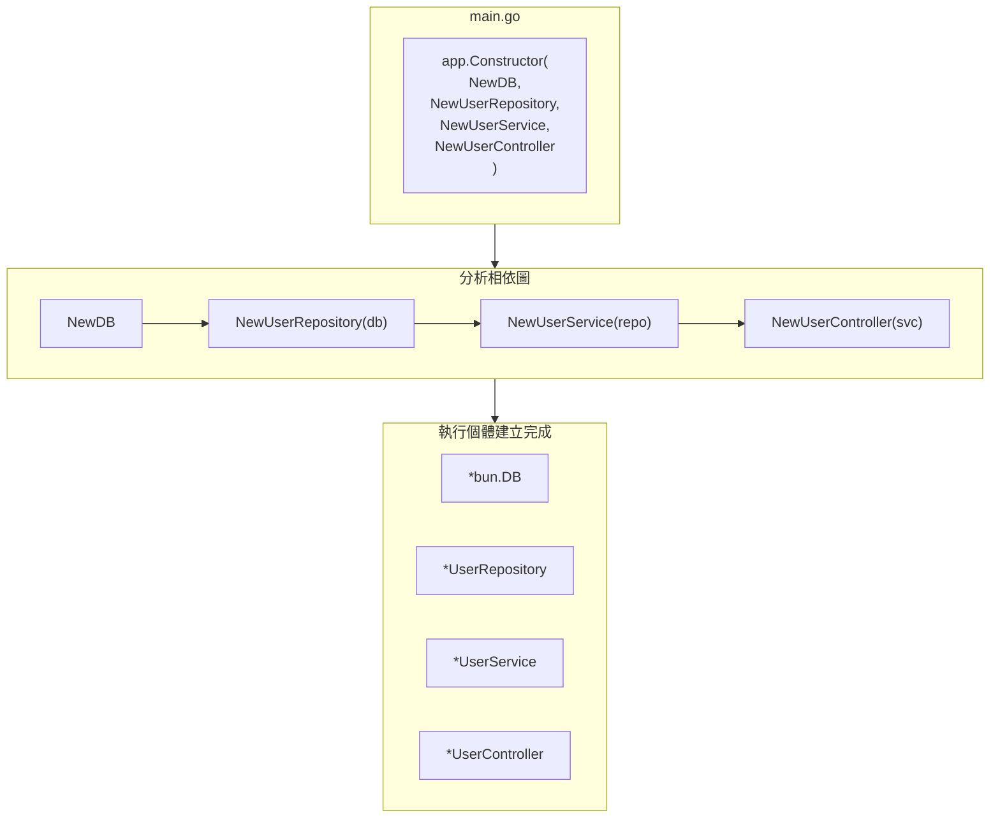

# 依賴注入

了解 Spine 的 DI。

## 關鍵概念

Spine 的依賴注入是**基於建構子的**。

- 無註解（`@Autowired`、`@Injectable` 不需要）
- 沒有設定檔
- 建構子參數被宣告為依賴項

```go
// 透過查看參數類型自動注入依賴項
func NewUserService(repo *UserRepository) *UserService {
    return &UserService{repo: repo}
}
```

## 基本用法

### 1. 寫建構函數

每個組件都有一個構造函數。

```go
// 儲存庫.go
type UserRepository struct {
    db *bun.DB
}

func NewUserRepository(db *bun.DB) *UserRepository {
    return &UserRepository{db: db}
}

// 服務.go
type UserService struct {
    repo *UserRepository
}

func NewUserService(repo *UserRepository) *UserService {
    return &UserService{repo: repo}
}

// 控制器.go
type UserController struct {
    svc *UserService
}

func NewUserController(svc *UserService) *UserController {
    return &UserController{svc: svc}
}
```

### 2.建構子註冊

在 `app.Constructor()` 中註冊一個建構子。

```go
func main() {
    app := spine.New()

    app.Constructor(
        NewDB,              // 返回 *bun.DB
        NewUserRepository,  // 需要 *bun.DB → 返回 *UserRepository
        NewUserService,     // 需要 *UserRepository → 返回 *UserService
        NewUserController,  // 需要 *UserService → 返回 *UserController
    )

    if err := app.Run(boot.Options{
		Address:                ":8080",
		EnableGracefulShutdown: true,
		ShutdownTimeout:        10 * time.Second,
		HTTP: &boot.HTTPOptions{},
	}); err != nil {
		log.Fatal(err)
	}
}
```

### 3.自動解析

Spine 分析依賴圖並以正確的順序建立實例。

```
注册顺序：任意
执行顺序：DB → Repository → Service → Controller
```

## 任一訂單

註冊順序並不重要。 Spine 分析依賴關係並自動對它們進行排序。

```go
// 即使你這樣註冊
app.Constructor(
    NewUserController,  // 需要 UserService
    NewUserService,     // 需要 UserRepository
    NewUserRepository,  // 需要 bun.DB
    NewDB,
)

// 實際的創建順序是
// 1.NewDB()
// 2.新建用戶儲存庫(db)
// 3.NewUserService（回購）
// 4.新建用戶控制器(svc)
```

## 依賴關係圖

### 視覺化



## 建構函式規則

### 參數

建構函式參數必須是**已註冊的型別**。

```go
// ✅ 正確的例子
func NewUserService(repo *UserRepository) *UserService

// ✅ 可能有多個依賴項
func NewUserController(svc *UserService, logger *Logger) *UserController

// ✅ 沒有依賴性
func NewLogger() *Logger
```

### 傳回類型

建構函數傳回**單一值**或**（值，錯誤）**。

```go
// ✅ 傳回單一值
func NewUserService(repo *UserRepository) *UserService {
    return &UserService{repo: repo}
}

// ✅ 可能回傳錯誤
func NewDB() (*bun.DB, error) {
    db, err := sql.Open("mysql", "...")
    if err != nil {
        return nil, err
    }
    return bun.NewDB(db, mysqldialect.New()), nil
}
```

## 使用介面

### 問題狀況

使用交易時，儲存庫必須同時處理 `*bun.DB` 和 `*bun.Tx`。

```go
// ❌這將禁用交易
type UserRepository struct {
    db *bun.DB  // 无法接收 *bun.Tx
}
```

### 已解決：使用接口

`bun.IDB` 介面可讓您同時容納兩者。

```go
// ✅ Bun.IDB 實作了 *bun.DB 和 *bun.Tx
type UserRepository struct {
    db bun.IDB
}

func NewUserRepository(db bun.IDB) *UserRepository {
    return &UserRepository{db: db}
}
```

### 攔截器中的交易注入

```go
// 攔截器/tx_interceptor.go
func (i *TxInterceptor) PreHandle(ctx core.ExecutionContext, meta core.HandlerMeta) error {
    tx, err := i.db.BeginTx(ctx.Context(), nil)
    if err != nil {
        return err
    }

    ctx.Set("tx", tx)  // 保存事务
    return nil
}

func (i *TxInterceptor) AfterCompletion(ctx core.ExecutionContext, meta core.HandlerMeta, err error) {
    tx, ok := ctx.Get("tx")
    if !ok {
        return
    }

    if err != nil {
        tx.(*bun.Tx).Rollback()
    } else {
        tx.(*bun.Tx).Commit()
    }
}
```

## 註冊多個元件

### 以域分隔

```go
func main() {
    app := spine.New()

    // 基礎設施
    app.Constructor(
        NewDB,
        NewRedisClient,
        NewLogger,
    )

    // 使用者網域
    app.Constructor(
        repository.NewUserRepository,
        service.NewUserService,
        controller.NewUserController,
    )

    // 訂購域名
    app.Constructor(
        repository.NewOrderRepository,
        service.NewOrderService,
        controller.NewOrderController,
    )

    if err := app.Run(boot.Options{
		Address:                ":8080",
		EnableGracefulShutdown: true,
		ShutdownTimeout:        10 * time.Second,
		HTTP: &boot.HTTPOptions{},
	}); err != nil {
		log.Fatal(err)
	}
}
```

### 可以多次調用

`app.Constructor()` 可以被多次呼叫。

```go
app.Constructor(NewDB)
app.Constructor(NewUserRepository, NewUserService)
app.Constructor(NewUserController)
```

## 多個相同類型

如果需要同一類型的多個實例，請使用包裝類型。

```go
// ❌ 難以區分
func NewApp(db1 *bun.DB, db2 *bun.DB) *App  // 无法区分各自用途

// ✅ 依包裝類型分類
type PrimaryDB struct{ *bun.DB }
type ReplicaDB struct{ *bun.DB }

func NewPrimaryDB() *PrimaryDB {
    return &PrimaryDB{connectToPrimary()}
}

func NewReplicaDB() *ReplicaDB {
    return &ReplicaDB{connectToReplica()}
}

func NewUserRepository(primary *PrimaryDB, replica *ReplicaDB) *UserRepository {
    return &UserRepository{
        writer: primary.DB,
        reader: replica.DB,
    }
}
```## 錯誤處理

### 循環依賴

```go
// ❌A→B→A循環
func NewA(b *B) *A { ... }
func NewB(a *A) *B { ... }

// 啟動時出現錯誤
// 恐慌：偵測到循環依賴：*A
```

### 缺少依賴項

```go
// 如果您沒有註冊UserRepository
app.Constructor(
    NewUserService,     // *需要 UserRepository
    NewUserController,
)

// 啟動時出現錯誤
// 恐慌：沒有註冊建構子：*repository.UserRepository
```

## 主要摘要

|概念|描述 |
|------|------|
| **基於建構子** |宣告與參數型別的依賴關係 |
| **自動解析** |不考慮註冊順序，圖分析後產生|
| **類型匹配** |相同類型自動注入 |
| **介面** |靈活的依賴性處理成為可能 |

## 後續步驟

- [教學：攔截器](/zh-Hant/learn/tutorial/4-interceptor) — 請求前/請求後處理
- [教學：資料庫](/zh-Hant/learn/tutorial/5-database) — Bun ORM 連接
