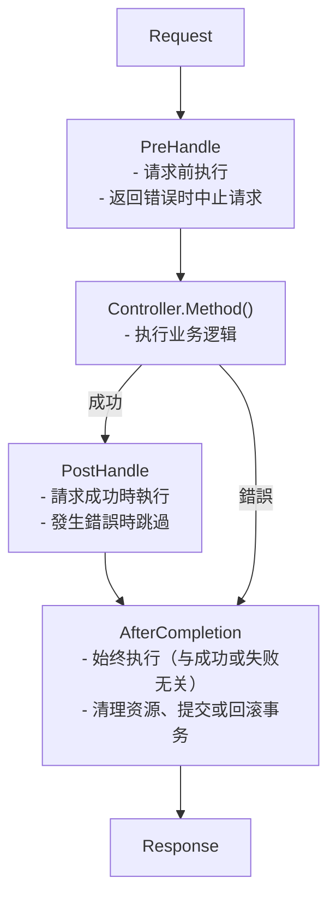

# 攔截器

建立和使用攔截器。

## 什麼是攔截器？

攔截器是在請求之前/之後運行的邏輯。

- 交易管理
- 日誌記錄
- 認證/授權
- 請求驗證

## 生命週期

攔截器的生命週期分為三個階段。



## 介面

```go
type Interceptor interface {
    PreHandle(ctx ExecutionContext, meta HandlerMeta) error
    PostHandle(ctx ExecutionContext, meta HandlerMeta)
    AfterCompletion(ctx ExecutionContext, meta HandlerMeta, err error)
}
```

|方法|何時跑步 |返回 |使用 |
|--------|----------|------|-----|
| `PreHandle` | `PreHandle`運行控制器之前 | `error` | `error`認證、驗證、交易啟動 |
| `PostHandle` | `PostHandle`控制器成功後 |無 |回應處理 |
| `AfterCompletion` | `AfterCompletion`總是（成功/失敗）|無 |資源清理、提交/回溯 |

## 全域攔截器與路由攔截器

Spine 支援兩級攔截器。

|類別 |全域攔截器|路由攔截器|
|------|--------------|----------------|
|適用範圍 |所有請求 |僅特定路線|
|如何註冊 | `app.Interceptor()` | `app.Interceptor()` `route.WithInterceptors()` | `route.WithInterceptors()`
|使用| CORS、日誌記錄、交易 |認證、授權檢查|
|執行訂單 |先運行|跟隨全球|

## 全域攔截器

這是套用於所有請求的攔截器。

### 日誌攔截器範例

```go
// 攔截器/logging_interceptor.go
package interceptor

import (
    "log"
    "github.com/NARUBROWN/spine/core"
)

type LoggingInterceptor struct{}

func (i *LoggingInterceptor) PreHandle(ctx core.ExecutionContext, meta core.HandlerMeta) error {
    log.Printf("[REQ] %s %s → %s.%s",
        ctx.Method(),
        ctx.Path(),
        meta.ControllerType.Name(),
        meta.Method.Name,
    )
    return nil
}

func (i *LoggingInterceptor) PostHandle(ctx core.ExecutionContext, meta core.HandlerMeta) {
    log.Printf("[RES] %s %s OK",
        ctx.Method(),
        ctx.Path(),
    )
}

func (i *LoggingInterceptor) AfterCompletion(ctx core.ExecutionContext, meta core.HandlerMeta, err error) {
    if err != nil {
        log.Printf("[ERR] %s %s : %v",
            ctx.Method(),
            ctx.Path(),
            err,
        )
    }
}
```

### 註冊全域攔截器

```go
func main() {
    app := spine.New()
    
    // 全域攔截器－適用於所有請求
    app.Interceptor(
        &interceptor.LoggingInterceptor{},
    )
    
    app.Run(boot.Options{
		Address:                ":8080",
		EnableGracefulShutdown: true,
		ShutdownTimeout:        10 * time.Second,
		HTTP: &boot.HTTPOptions{},
	})
}
```

## 路由攔截器

這是一個僅適用於特定路由的攔截器。

### 身份驗證攔截器範例

```go
// 攔截器/auth_interceptor.go
package interceptor

import (
    "github.com/NARUBROWN/spine/core"
    "github.com/NARUBROWN/spine/pkg/httperr"
)

type AuthInterceptor struct{}

func (i *AuthInterceptor) PreHandle(ctx core.ExecutionContext, meta core.HandlerMeta) error {
    token := ctx.Header("Authorization")
    
    if token == "" {
        return httperr.Unauthorized("需要认证.")
    }
    
    user, err := validateToken(token)
    if err != nil {
        return httperr.Unauthorized("令牌无效.")
    }
    
    ctx.Set("currentUser", user)
    return nil
}

func (i *AuthInterceptor) PostHandle(ctx core.ExecutionContext, meta core.HandlerMeta) {}

func (i *AuthInterceptor) AfterCompletion(ctx core.ExecutionContext, meta core.HandlerMeta, err error) {}

func validateToken(token string) (map[string]string, error) {
    // 令牌驗證邏輯
    return map[string]string{"id": "1", "name": "Alice"}, nil
}
```

### 註冊路由攔截器

使用 `route.WithInterceptors()`。

```go
import (
    "github.com/NARUBROWN/spine"
    "github.com/NARUBROWN/spine/pkg/route"
)

func main() {
    app := spine.New()
    
    app.Constructor(
        NewUserController,
    )
    
    // 不需要認證的路由
    app.Route(
        "POST",
        "/login",
        (*UserController).Login,
    )
    
    // 需要身份驗證的路由
    app.Route(
        "GET",
        "/users/:id",
        (*UserController).GetUser,
        route.WithInterceptors(&interceptor.AuthInterceptor{}),
    )
    
    // 需要身份驗證的路由
    app.Route(
        "PUT",
        "/users/:id",
        (*UserController).UpdateUser,
        route.WithInterceptors(&interceptor.AuthInterceptor{}),
    )
    
    app.Run(boot.Options{
		Address:                ":8080",
		EnableGracefulShutdown: true,
		ShutdownTimeout:        10 * time.Second,
		HTTP: &boot.HTTPOptions{},
	})
}
```

## 全域+路由攔截器組合

在實際應用中，兩者是結合使用的。

```go
func main() {
    app := spine.New()
    
    app.Constructor(
        NewUserController,
    )
    
    // 全域攔截器－適用於所有請求
    app.Interceptor(
        &interceptor.LoggingInterceptor{},
        cors.New(cors.Config{
            AllowOrigins: []string{"*"},
            AllowMethods: []string{"GET", "POST", "PUT", "DELETE"},
        }),
    )
    
    // 公共路線－僅適用全球攔截器
    app.Route("POST", "/login", (*UserController).Login)
    app.Route("POST", "/signup", (*UserController).Signup)
    
    // 身份驗證所需的路由 - 全域 + 身份驗證攔截器
    app.Route(
        "GET",
        "/users/:id",
        (*UserController).GetUser,
        route.WithInterceptors(&interceptor.AuthInterceptor{}),
    )
    
    app.Route(
        "GET",
        "/me",
        (*UserController).GetMe,
        route.WithInterceptors(&interceptor.AuthInterceptor{}),
    )
    
    app.Run(boot.Options{
		Address:                ":8080",
		EnableGracefulShutdown: true,
		ShutdownTimeout:        10 * time.Second,
		HTTP: &boot.HTTPOptions{},
	})
}
```

## 執行順序

全域攔截器先運行，路由攔截器最後運行。

### 註冊範例

```go
// 全域攔截器
app.Interceptor(
    &interceptor.LoggingInterceptor{},   // 全局 1
    &interceptor.CORSInterceptor{},      // 全局 2
)

// 路由攔截器
app.Route(
    "GET",
    "/users/:id",
    (*UserController).GetUser,
    route.WithInterceptors(&interceptor.AuthInterceptor{}),  // 路由 1
)
```

### 執行流程

```
Request (GET /users/1)
   │
   ├─→ Logging.PreHandle     (全局 1)
   ├─→ CORS.PreHandle        (全局 2)
   ├─→ Auth.PreHandle        (路由 1)
   │
   ├─→ UserController.GetUser
   │
   ├─→ Auth.PostHandle       (路由 1)
   ├─→ CORS.PostHandle       (全局 2)
   ├─→ Logging.PostHandle    (全局 1)
   │
   ├─→ Auth.AfterCompletion       (路由 1)
   ├─→ CORS.AfterCompletion       (全局 2)
   └─→ Logging.AfterCompletion    (全局 1)
   
Response
```

- `PreHandle`：全域 → 路由順序
- `PostHandle`：路由 → 全域逆序
- `AfterCompletion`：路由 → 全域逆序

## 錯誤處理

### PreHandle 回傳錯誤

如果 `PreHandle` 傳回錯誤，則請求將中止。

```go
func (i *AuthInterceptor) PreHandle(ctx core.ExecutionContext, meta core.HandlerMeta) error {
    token := ctx.Header("Authorization")
    if token == "" {
        return httperr.Unauthorized("需要认证.")
    }
    return nil
}
```

```
Request (GET /users/1, 没有令牌)
   │
   ├─→ Logging.PreHandle     ✓
   ├─→ CORS.PreHandle        ✓
   ├─→ Auth.PreHandle        ✗ (返回错误)
   │
   ├─→ Auth.AfterCompletion
   ├─→ CORS.AfterCompletion
   └─→ Logging.AfterCompletion
   
Response (401 Unauthorized)
```

## 執行上下文

在請求上下文中儲存和檢索值。

＃＃＃ 方法

|方法|描述 |
|--------|------|
| `Context()` | `Context()`回傳 `context.Context` |
| `Method()` | `Method()` HTTP 方法（GET、POST 等）|
| `Path()` | `Path()`請求路徑|
| `Header(name)` | `Header(name)`標頭值查找 |
| `Set(key, value)` | `Set(key, value)`儲值|
| `Get(key)` | `Get(key)`值查找 |

### 在攔截器之間傳遞數據

```go
// AuthInterceptor－儲存使用者資訊
func (i *AuthInterceptor) PreHandle(ctx core.ExecutionContext, meta core.HandlerMeta) error {
    token := ctx.Header("Authorization")
    user, _ := validateToken(token)
    ctx.Set("currentUser", user)
    return nil
}

// 必須注入 ExecutionContext 才能在控制器中進行查詢
// 或在另一個攔截器中尋找
func (i *AuditInterceptor) PreHandle(ctx core.ExecutionContext, meta core.HandlerMeta) error {
    user, ok := ctx.Get("currentUser")
    if ok {
        log.Printf("User %v accessing %s", user, ctx.Path())
    }
    return nil
}
```

## 處理程式元數據

有關要執行的處理程序的元資訊。

|領域 |類型 |描述 |
|------|------|------|
| `ControllerType` | `ControllerType` `reflect.Type` | `reflect.Type`控制器類型 |
| `Method` | `Method` `reflect.Method` | `reflect.Method`處理程序方法 |
| `Interceptors` | `Interceptors` `[]Interceptor` | `[]Interceptor`攔截器綁定到路由 |

### 用法範例

```go
func (i *LoggingInterceptor) PreHandle(ctx core.ExecutionContext, meta core.HandlerMeta) error {
    log.Printf("控制器: %s", meta.ControllerType.Name())  // UserController
    log.Printf("方法: %s", meta.Method.Name)              // GetUser
    return nil
}
```

## 需要依賴注入的攔截器

具有建構函式的攔截器首先使用 `Constructor` 註冊。

### 事務攔截器範例

```go
// 攔截器/tx_interceptor.go
package interceptor

import (
    "github.com/NARUBROWN/spine/core"
    "github.com/uptrace/bun"
)

type TxInterceptor struct {
    db *bun.DB
}

func NewTxInterceptor(db *bun.DB) *TxInterceptor {
    return &TxInterceptor{db: db}
}

func (i *TxInterceptor) PreHandle(ctx core.ExecutionContext, meta core.HandlerMeta) error {
    tx, err := i.db.BeginTx(ctx.Context(), nil)
    if err != nil {
        return err
    }
    ctx.Set("tx", tx)
    return nil
}

func (i *TxInterceptor) PostHandle(ctx core.ExecutionContext, meta core.HandlerMeta) {}

func (i *TxInterceptor) AfterCompletion(ctx core.ExecutionContext, meta core.HandlerMeta, err error) {
    v, ok := ctx.Get("tx")
    if !ok {
        return
    }
    
    tx := v.(*bun.Tx)
    if err != nil {
        tx.Rollback()
    } else {
        tx.Commit()
    }
}
```

### 註冊（全球）

```go
app.Constructor(
    NewDB,
    interceptor.NewTxInterceptor,
)

app.Interceptor(
    (*interceptor.TxInterceptor)(nil),  // 按类型引用
)
```

### 註冊（路線）

```go
app.Constructor(
    NewDB,
    interceptor.NewTxInterceptor,
)

app.Route(
    "POST",
    "/orders",
    (*OrderController).CreateOrder,
    route.WithInterceptors((*interceptor.TxInterceptor)(nil)),  // 按类型引用
)
```

## 註冊方法總結

### 全域攔截器

|方法|程式碼|何時使用 |
|------|------|----------|
|直接實例交付 | `&interceptor.LoggingInterceptor{}` | `&interceptor.LoggingInterceptor{}`無依賴|
|依型別參考 | `(*interceptor.TxInterceptor)(nil)` | `(*interceptor.TxInterceptor)(nil)`依賴|

```go
app.Interceptor(
    &interceptor.LoggingInterceptor{},      // 实例
    (*interceptor.TxInterceptor)(nil),      // 类型引用
)
```

### 路由攔截器

|方法|程式碼|何時使用 |
|------|------|----------|
|直接實例交付 | `&interceptor.AuthInterceptor{}` | `&interceptor.AuthInterceptor{}`無依賴 |
|依型別參考 | `(*interceptor.TxInterceptor)(nil)` | `(*interceptor.TxInterceptor)(nil)`依賴|

```go
app.Route(
    "GET",
    "/users/:id",
    (*UserController).GetUser,
    route.WithInterceptors(
        &interceptor.AuthInterceptor{},         // 实例
        (*interceptor.TxInterceptor)(nil),      // 类型引用
    ),
)
```

## 主要摘要

|概念|描述 |
|------|------|
| **全域攔截器** | `app.Interceptor()` — 適用於所有請求 |
| **路由攔截器** | `route.WithInterceptors()` — 僅特定路線 |
| **執行順序** |全域→路線（後/後相反的順序）|
| **3 階段生命週期** | PreHandle → PostHandle → AfterCompletion | 處理前 → 處理後 → 完成後 |
| **出錯時停止** | PreHandle 錯誤 → 控制器跳過 |
| **上下文共享** |將資料傳遞到 `ctx.Set()` / `ctx.Get()` |

## 後續步驟

- 教學：資料庫 — Bun ORM 連接
- 教學：錯誤處理 — 如何使用 httperr
