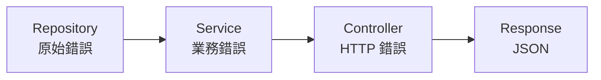
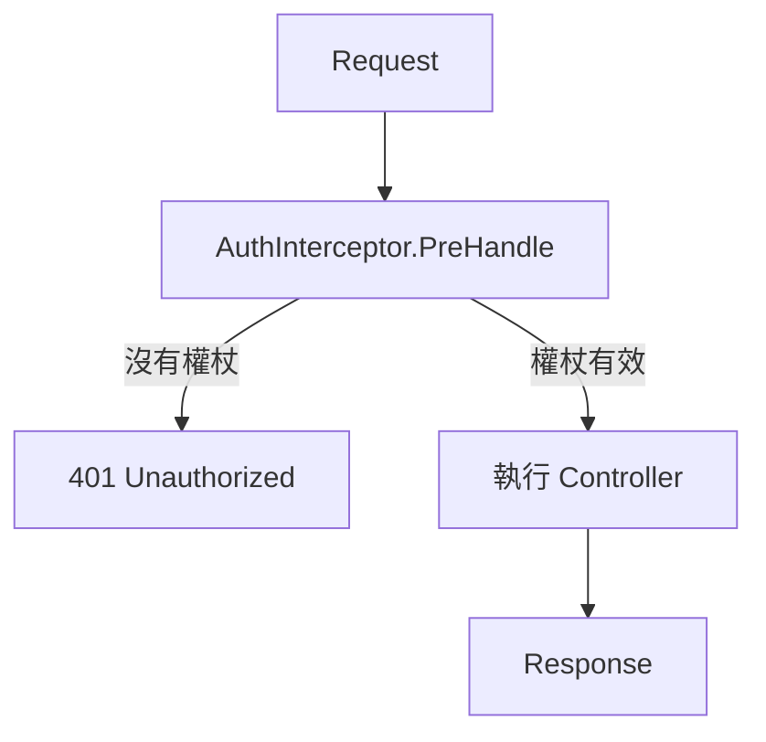

我檢查了代碼。事實上，`httperr` 套件中只有三個輔助函數：

```go
// pkg/httperr/types.go
func NotFound(msg string) error {
    return &HTTPError{Status: 404, Message: msg}
}

func BadRequest(msg string) error {
    return &HTTPError{Status: 400, Message: msg}
}

func Unauthorized(msg string) error {
    return &HTTPError{Status: 401, Message: msg}
}
```

讓我編輯一下文件：

---

# 錯誤處理

如何優雅地處理錯誤。

＃＃ 大綱

Spine 使用 `httperr` 套件表示 HTTP 錯誤。 Controller不直接處理HTTP，只用`httperr`來表達錯誤的**意義**。實際的 HTTP 回應轉換由 `ErrorReturnHandler` 處理。

```go
import "github.com/NARUBROWN/spine/pkg/httperr"

func (c *UserController) GetUser(userId path.Int) (User, error) {
    if userId.Value <= 0 {
        return User{}, httperr.BadRequest("用户 ID 无效")
    }
    
    user, err := c.repo.FindByID(userId.Value)
    if err != nil {
        return User{}, httperr.NotFound("找不到用户")
    }
    
    return user, nil
}
```

## httperr 函數

|功能|狀態碼|使用 |
|------|----------|------|
| `httperr.BadRequest(msg)` | `httperr.BadRequest(msg)` 400 |錯誤要求，輸入驗證失敗 |
| `httperr.Unauthorized(msg)` | `httperr.Unauthorized(msg)` 401 | 401需要驗證，令牌無效 |
| `httperr.NotFound(msg)` | `httperr.NotFound(msg)` 404 | 404沒有資源 |

## HTTPError 結構體

```go
type HTTPError struct {
    Status  int    // HTTP 状态码
    Message string // 错误消息
    Cause   error  // 原因错误（可选）
}

func (e *HTTPError) Error() string {
    return e.Message
}
```

## 用法範例

### 沒有資源 (404)

```go
func (c *UserController) GetUser(userId path.Int) (User, error) {
    user, err := c.repo.FindByID(userId.Value)
    if err != nil {
        return User{}, httperr.NotFound("找不到用户")
    }
    return user, nil
}
```

回覆:```json
{"message": "找不到使用者"}
```
```
HTTP/1.1 404 Not Found
```

### 錯誤請求 (400)

```go
func (c *UserController) CreateUser(req CreateUserRequest) (User, error) {
    if req.Name == "" {
        return User{}, httperr.BadRequest("姓名為必填項目")
    }
    if req.Email == "" {
        return User{}, httperr.BadRequest("電子郵件為必填項目")
    }
    
    return c.service.Create(req)
}
```

### 需要身份驗證 (401)

```go
func (i *AuthInterceptor) PreHandle(ctx core.ExecutionContext, meta core.HandlerMeta) error {
    token := ctx.Header("Authorization")
    
    if token == "" {
        return httperr.Unauthorized("需要驗證")
    }
    
    if !isValidToken(token) {
        return httperr.Unauthorized("權杖無效")
    }
    
    return nil
}
```

## 使用不同的狀態程式碼

如果您需要未提供的狀態代碼，請自行產生 `HTTPError` 。

```go
// 403 禁忌
func Forbidden(msg string) error {
    return &httperr.HTTPError{Status: 403, Message: msg}
}

// 409 衝突
func Conflict(msg string) error {
    return &httperr.HTTPError{Status: 409, Message: msg}
}

// 500 內部伺服器錯誤
func InternalServerError(msg string) error {
    return &httperr.HTTPError{Status: 500, Message: msg}
}
```

## 按層進行錯誤處理



### 儲存庫

原始錯誤按原樣返回。

```go
func (r *UserRepository) FindByID(id int64) (*User, error) {
    user, ok := r.users[id]
    if !ok {
        return nil, ErrUserNotFound  // 原始錯誤
    }
    return user, nil
}

var ErrUserNotFound = errors.New("user not found")
```

＃＃＃ 服務

處理業務邏輯並傳遞儲存庫錯誤。

```go
func (s *UserService) GetUser(id int64) (*User, error) {
    user, err := s.repo.FindByID(id)
    if err != nil {
        return nil, err  // 傳遞錯誤
    }
    return user, nil
}
```

＃＃＃控制器

將業務錯誤轉換為 HTTP 錯誤。

```go
func (c *UserController) GetUser(userId path.Int) (User, error) {
    user, err := c.service.GetUser(userId.Value)
    if err != nil {
        return User{}, toHTTPError(err)
    }
    return *user, nil
}

func toHTTPError(err error) error {
    switch {
    case errors.Is(err, repository.ErrUserNotFound):
        return httperr.NotFound("找不到使用者")
    case errors.Is(err, repository.ErrEmailAlreadyExists):
        return httperr.BadRequest("電子郵件已被使用")
    default:
        return httperr.BadRequest(err.Error())
    }
}
```

## 輸入驗證

### 在DTO中定義驗證方法

```go
type CreateUserRequest struct {
    Name  string `json:"name"`
    Email string `json:"email"`
}

func (r *CreateUserRequest) Validate() error {
    if r.Name == "" {
        return errors.New("姓名為必填項目")
    }
    if len(r.Name) > 100 {
        return errors.New("姓名不得超過 100 個字元")
    }
    if r.Email == "" {
        return errors.New("電子郵件為必填項目")
    }
    return nil
}
```

### 來自控制器的驗證調用

```go
func (c *UserController) CreateUser(req CreateUserRequest) (User, error) {
    if err := req.Validate(); err != nil {
        return User{}, httperr.BadRequest(err.Error())
    }
    
    return c.service.Create(req)
}
```

## 攔截器中的錯誤處理

如果 `PreHandle` 傳回錯誤，控制器將不會運作。

```go
func (i *AuthInterceptor) PreHandle(ctx core.ExecutionContext, meta core.HandlerMeta) error {
    token := ctx.Header("Authorization")
    
    if token == "" {
        return httperr.Unauthorized("需要驗證權杖")
    }
    
    user, err := i.auth.Validate(token)
    if err != nil {
        return httperr.Unauthorized("權杖無效")
    }
    
    ctx.Set("auth.user", user)
    return nil
}
```



## 錯誤記錄

您可以在 `AfterCompletion` 中記錄錯誤。

```go
func (i *LoggingInterceptor) AfterCompletion(ctx core.ExecutionContext, meta core.HandlerMeta, err error) {
    if err != nil {
        log.Printf("[ERR] %s %s : %v", ctx.Method(), ctx.Path(), err)
    }
}
```

## 一般錯誤處理

普通的 `error` 而非 `httperr.HTTPError` 被視為 500 狀態碼。

```go
// httperr.HTTPError → 指定狀態碼
return httperr.NotFound("...")  // → 404

// 一般錯誤 → 500
return errors.New("something went wrong")  // → 500
```

## 主要摘要

|等級 |角色 |
|------|------|
|儲存庫 |傳回原始錯誤 |
|服務 |業務邏輯處理、錯誤傳輸 |
|控制器|轉換為 HTTP 錯誤 |
|攔截器|常見錯誤處理（驗證、日誌記錄）|

| httperr 函數 |狀態碼|
|--------------|----------|
| `BadRequest` | `BadRequest` 400 |
| `Unauthorized` | `Unauthorized` 401 | 401
| `NotFound` | `NotFound` 404 | 404
