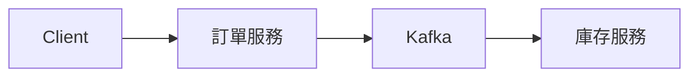

# 以 Kafka 為基礎的 MSA 範例

本範例包含發布訂單事件的訂單服務，以及消費事件並更新庫存的庫存服務。


```mermaid
graph LR
    Client --> Order[訂單服務]
    Order --> Kafka[Kafka]
    Kafka --> Stock[庫存服務]
```

訂單控制器建立訂單後發布領域事件；庫存服務註冊消費者處理器。消費者同樣經由 Spine 的執行管線，因此可以使用相依性注入、參數解析和攔截器。

```go
app.Consumers(stock.NewOrderCreatedConsumer)
```
